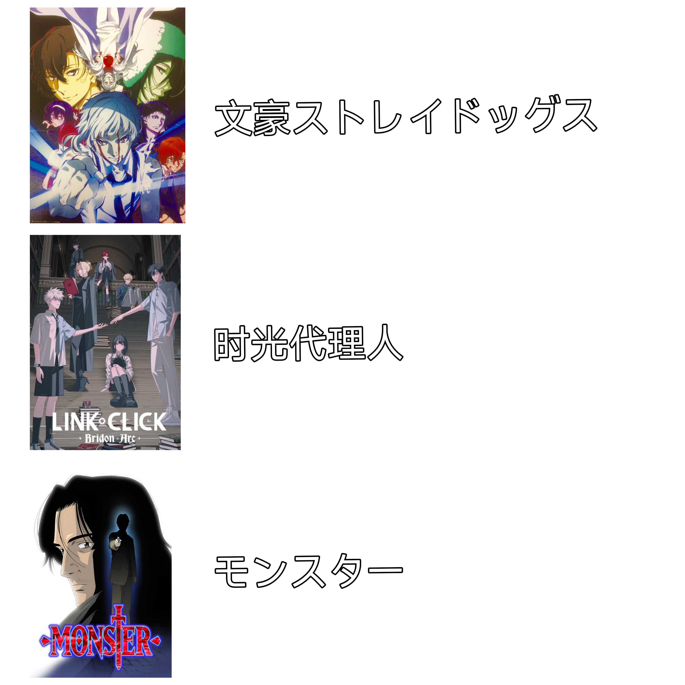
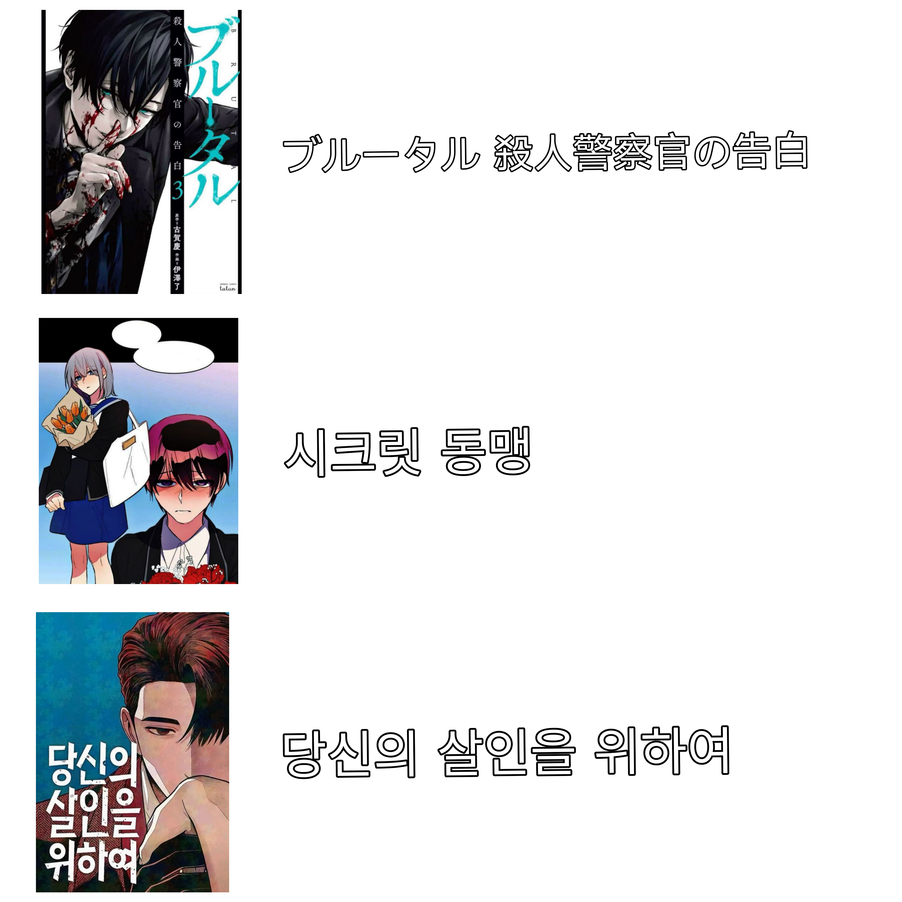
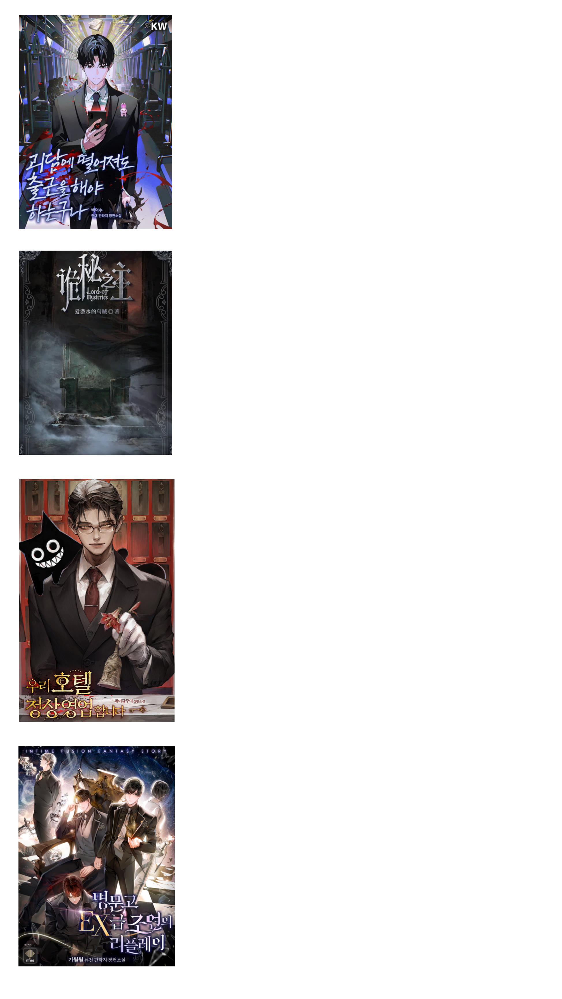
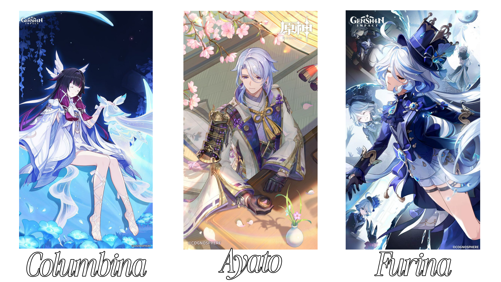
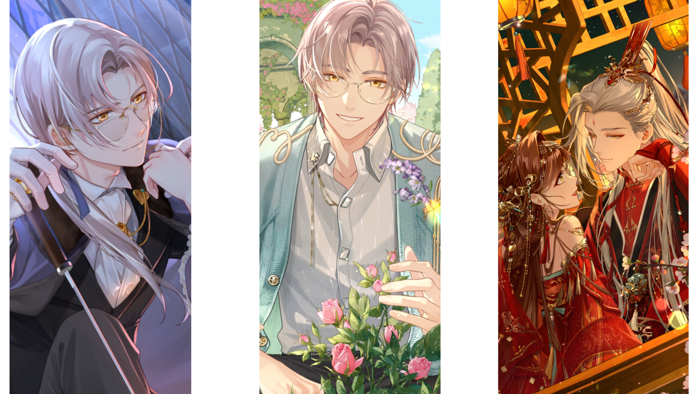
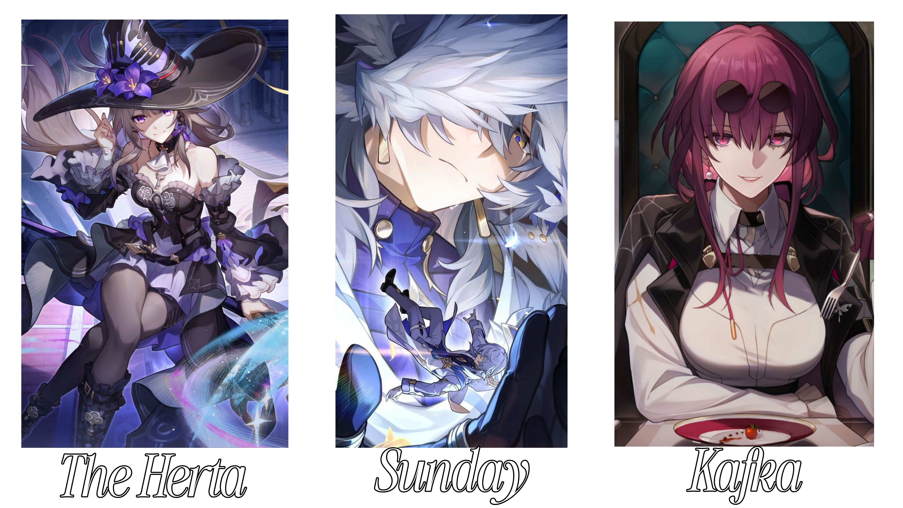

  

  

  

 

    

      <samp>
        <b>More Info</b>
      </samp>
    

     

  
  
  
   

 
  
  
  
  
  
  
  
  
  
  
  

 

##

 

  
  
  
  
  
  
  
  

<!-- ┌──────────── ROW 1 · ANIMATIONS + COMICS ─────────────────────────────────┐ -->

<table>
<tr>
<td width="50%" align="center"></td>
<td width="50%" align="center"></td>
</tr>
<tr>

<td width="50%" align="center" valign="top">

</td>

<td width="50%" align="center" valign="top">

</td>

</tr>
</table>

<!-- ┌──────────── ROW 2 · NOVELS + GAMES ──────────────────────┐ -->

<table>
<tr>
<td width="50%" align="center"></td>
<td width="50%" align="center"></td>
</tr>
<tr>
<td width="50%" align="center" valign="top">

</td>

<td width="50%" align="center" valign="top">
 

 
 

 
 

</td>
</tr>
</table>

##

 
 

